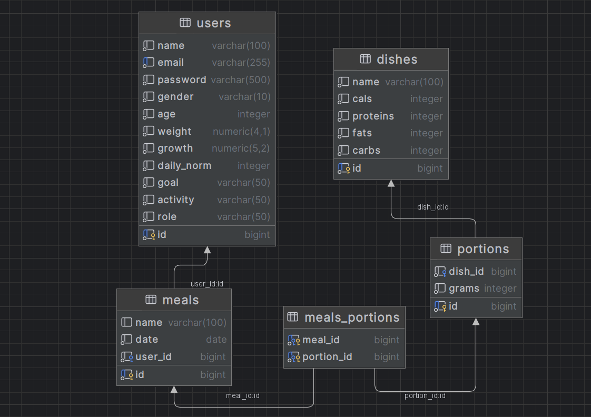
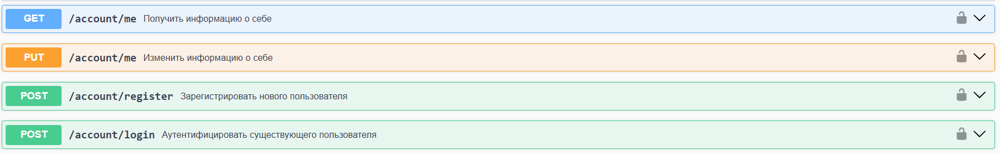
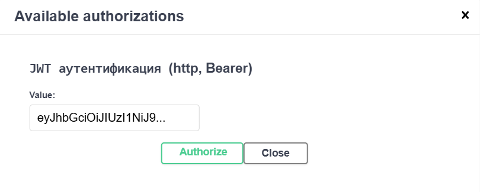
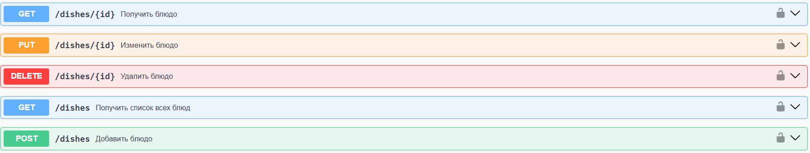
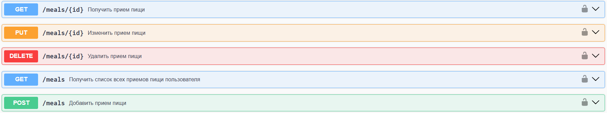
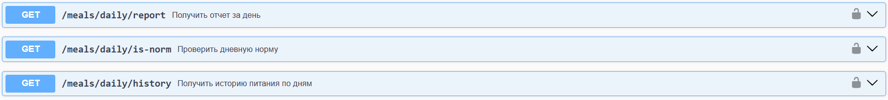
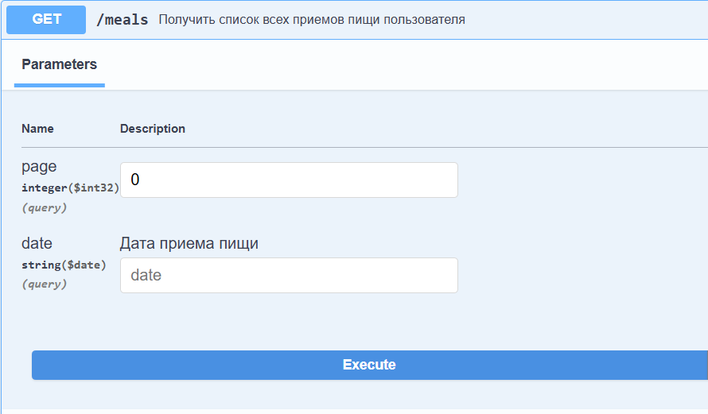

# Daily Fitness API
Данный проект представляет собой REST API сервис для отслеживания дневной нормы калорий пользователя и учета съеденных блюд
  
> Проект создан в рамках тестового задания, и не является коммерческим

## Суточная норма калорий
На основе данных пользователя, а именно `Возраст`, `Вес`, `Рост`, `Пол`, `Активность` вычисляется индивидуальная суточная норма калорий.

Вычисление строится по формуле `Харриса-Бенедикта`, конкретная формула зависит от пола:

Для мужчин: $`ПБМ = 88,36 + (13,4 × вес в кг) + (4,8 × рост в см) – (5,7 × возраст в годах)`$

Для женщин: $`ПБМ = 447,6 + (9,2 × вес в кг) + (3,1 × рост в см) – (4,3 × возраст в годах)`$

Далее $`ПБМ`$ умножается на коэфициент, который зависит от ежедневной активности:

- Нет активности: $`ПБМ = ПБМ * 1.2`$
- Минимальная активность: $`ПБМ = ПБМ * 1.375`$
- Средняя активность: $`ПБМ = ПБМ * 1.55`$
- Высокая активность: $`ПБМ = ПБМ * 1.725`$
- Очень высокая (экстремальная) активность: $`ПБМ = ПБМ * 1.9`$

В зависимости от выбранной цели, пользователь должен соблюдать соответствующие неравенства потребляемого им калоража и его нормы:

- Набор веса: `суточное потребление пищи в калориях` > `суточной нормы`
- Поддержание веса: `суточное потребление пищи в калориях` ~ `суточной нормы`
- Сброс веса: `суточное потребление пищи в калориях` < `суточной нормы`

## Роли пользователей
### Обычный пользователь
- Получает и изменяет информацию о себе
- Получает информацию о существующих блюдах
- Добавляет, изменяет и удаляет свои приемы пищи
- Получает отчеты за день с суммой всех калорий и `БЖУ`
- Проверяет, уложился ли он в свою дневную норму
- Просматривает историю своего питания по дням
### Администратор
- Обладает всеми привилегиями обычного пользователя
- Добавляет, изменяет и удаляет блюда

## База данных
В качестве базы данных используется `PostgreSQL 17`

Схема базы данных представлена на рисунке ниже

<br>

## Авторизация
- Чтобы авторизовать пользователя в системе необходимо использовать эндпоинты `/account/register` для регистрации и `/account/login` для авторизации
- В ответном сообщении будет находится `JWT-токен`, который используется для доступа ко всем ресурсам

Эндпоинты авторизации находятся на пути `/account`

<br>

> JWT-токен добавляет один раз во все последующие заголовки через модальное окно
> <br>


## API эндпоинты
`/dishes` - доступ к блюдам и их администрирование

<br>

`/meals` - доступ к приемам пищи и управление ними

<br>

`/meals/daily` - ежедневные пользовательские отчеты с подробной (и не очень) информацией

<br>

> [!NOTE]  
> Отчеты представляют собой текстовые ответы в JSON-формате, а не сформированные документы 

## Swagger UI
- Чтобы корректно использовать API сервиса используйте `Swagger UI`, настроенный для него
- UI расположен по адресу `http://localhost:9000/api/swagger-ui`
- Все эндпоинты и схема данных документированы. Подробно описаны серверные ответы и обработчики исключений

<br>
## Тестовые данные
### Пользователи
| Имя   | Почта          | Пароль | Пол     | Возраст | Вес | Рост | Суточная норма калорий | Цель       | Активность  | Роль          |
|-------|----------------|--------|---------|---------|-----|------|------------------------|------------|-------------|---------------|
| admin | admin@mail.org | admin  | Мужской | 20      | 65  | 186  | 2100                   | Набор веса | Отсутствует | Администратор |
| puffy | puffy@mail.org | puffy  | Мужской | 25      | 90  | 175  | 2700                   | Сброс веса | Минимальная | Пользователь  |
| stacy | stacy@mail.org | stacy  | Женский | 24      | 50  | 165  | 2000                   | Набор веса | Средняя     | Пользователь  |
### Блюда
| Название блюда          | Калорий | Белков | Жиров | Углеводов |
|-------------------------|---------|--------|-------|-----------|
| Гречневая каша          | 120     | 4      | 1     | 25        |
| Куриная грудка          | 165     | 31     | 3     | 0         |
| Омлет с овощами         | 150     | 10     | 8     | 6         |
| Салат из свежих овощей  | 50      | 2      | 0     | 10        |
| Творог обезжиренный     | 90      | 18     | 0     | 3         |
| Яблоко                  | 52      | 0      | 0     | 14        |
| Банан                   | 89      | 1      | 0     | 23        |
| Овсяная каша            | 130     | 5      | 2     | 27        |
| Лосось на гриле         | 200     | 25     | 10    | 0         |
| Рис отварной            | 130     | 2      | 0     | 28        |
| Картофель запеченный    | 93      | 2      | 0     | 21        |
| Суп куриный             | 80      | 6      | 3     | 7         |
| Шоколадный батончик     | 250     | 3      | 12    | 30        |
| Йогурт натуральный      | 60      | 4      | 3     | 5         |
| Сыр твердый             | 400     | 25     | 30    | 0         |
### Приемы пищи
| Название приема пищи | Название блюда          | Количество грамм блюда | Дата приема пищи | Имя пользователя |
|----------------------|-------------------------|------------------------|------------------|------------------|
| Завтрак              | Гречневая каша          | 200                    | 2025-03-23       | admin            |
| Завтрак              | Куриная грудка          | 150                    | 2025-03-23       | admin            |
| Обед                 | Омлет с овощами         | 100                    | 2025-03-24       | admin            |
| Обед                 | Салат из свежих овощей  | 150                    | 2025-03-24       | admin            |
| Ужин                 | Творог обезжиренный     | 200                    | 2025-03-25       | admin            |
| Ужин                 | Яблоко                  | 100                    | 2025-03-25       | admin            |
| Завтрак              | Банан                   | 120                    | 2025-03-23       | puffy            |
| Завтрак              | Овсяная каша            | 200                    | 2025-03-23       | puffy            |
| Обед                 | Лосось на гриле         | 150                    | 2025-03-23       | puffy            |
| Обед                 | Рис отварной            | 200                    | 2025-03-23       | puffy            |
| Ужин                 | Картофель запеченный    | 150                    | 2025-03-23       | puffy            |
| Ужин                 | Суп куриный             | 300                    | 2025-03-23       | puffy            |
| Завтрак              | Шоколадный батончик     | 50                     | 2025-03-23       | stacy            |
| Завтрак              | Йогурт натуральный      | 200                    | 2025-03-23       | stacy            |
| Обед                 | Сыр твердый             | 100                    | 2025-03-23       | stacy            |
| Обед                 | Салат из свежих овощей  | 150                    | 2025-03-23       | stacy            |
| Ужин                 | Творог обезжиренный     | 200                    | 2025-03-23       | stacy            |
| Ужин                 | Яблоко                  | 100                    | 2025-03-23       | stacy            |

## Инструкция к запуску

1. Установите Docker Desktop на свой ПК (для daemon-а) https://docs.docker.com/desktop/setup/install/windows-install/
2. Установите и запустите `git bash`
3. Клонируйте репозиторий в желаемую папку

```shell
git clone https://github.com/duahifnv/daily-fitness-api.git
cd daily-fitness-api
```

4. Проверьте, что docker daemon запущен

```shell
docker --version
```

5. Запустите скрипт для локального деплоя приложения

>Запуск займет некоторое время, т.к. будут подгружаться необходимые образы
```shell
sh run.sh
```

> [!NOTE]  
> Скрипт должен автоматически запустить браузер по адресу `http://localhost:9000/api/swagger-ui`, само API находится по адресу `http://localhost:9000/api`
